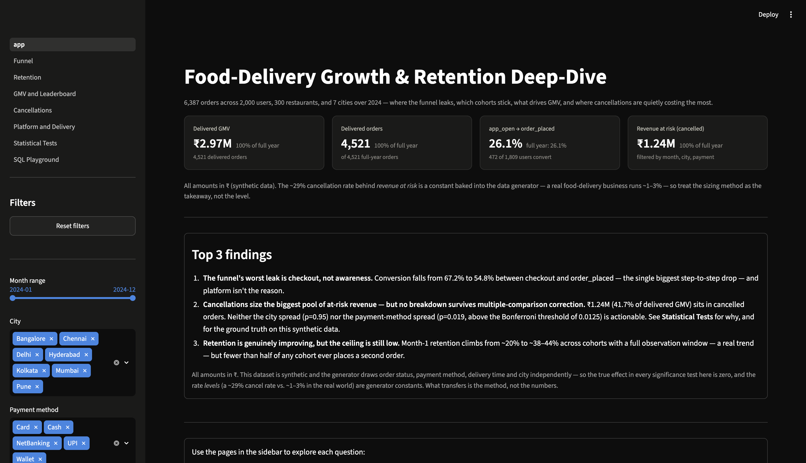
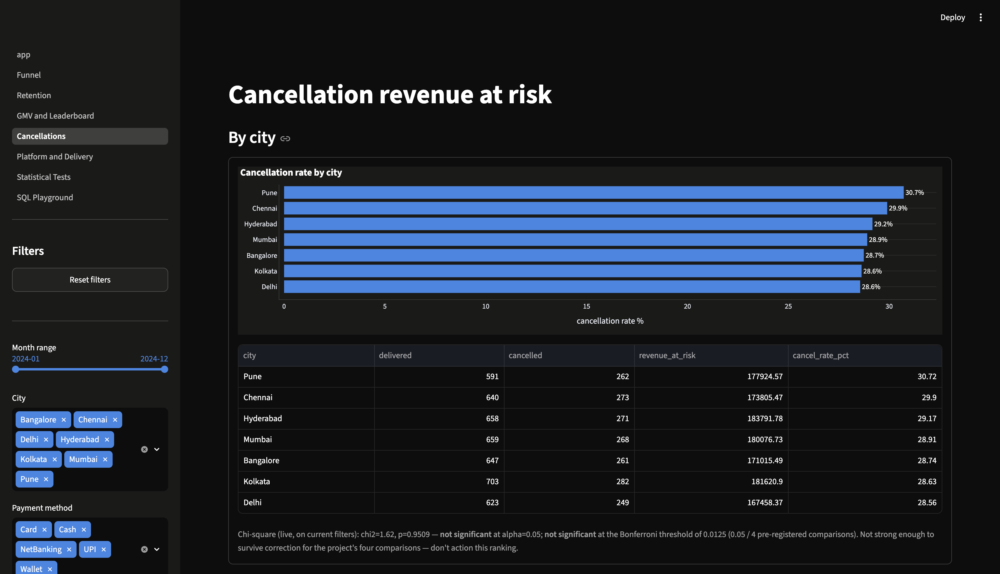
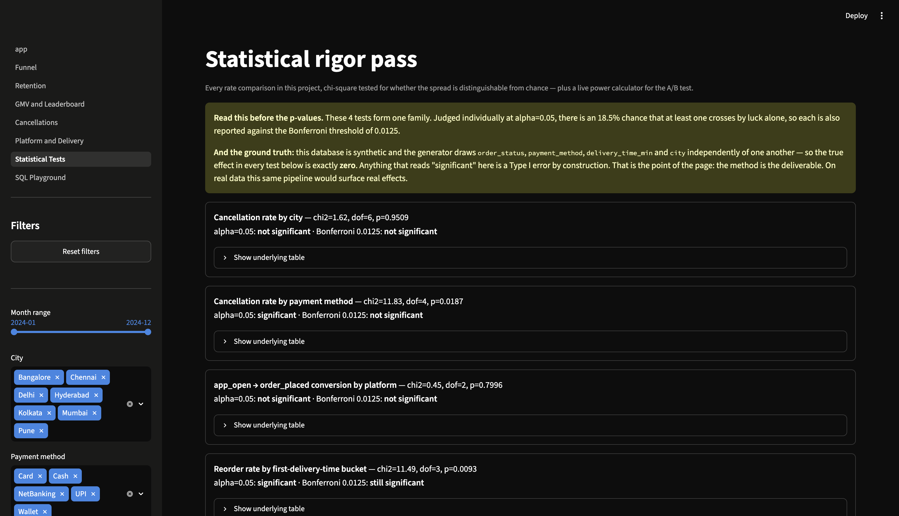

# Food-Delivery Growth & Retention Deep-Dive

[](https://github.com/shreyanshverma7/food-delivery-growth-retention-deep-dive/actions/workflows/ci.yml)
[](LICENSE)
[](requirements.txt)
[](https://food-delivery-growth-retention-deep-dive.streamlit.app/)

**[Try the live dashboard →](https://food-delivery-growth-retention-deep-dive.streamlit.app/)**

I analysed 6,387 orders from a food-delivery app (2,000 users, 300 restaurants, 7 cities, 2024) to find where users drop off in the funnel and which cohorts retain, then recommended where growth should invest.

## Top 3 findings

1. **The funnel's worst leak is checkout, not awareness.** Conversion falls from 67.2% to 54.8% between checkout and order_placed — the single biggest step-to-step drop in the funnel, and platform (iOS/Android/Web) isn't the reason (see "Platform" below) — this is a checkout-flow problem, not a device-specific one.
2. **Cancellations size the largest pool of at-risk revenue — and no breakdown of it survives multiple-comparison correction.** ₹1.24M of gross order value — 41.7% of delivered GMV — sits in cancelled orders. Neither the city spread (Pune 30.7% vs. Delhi 28.6%, p=0.95) nor the payment-method spread (UPI 32.2% vs. NetBanking 26.8%, p=0.019) clears the Bonferroni threshold of 0.0125 for this project's four tests. Chasing either would have been chasing noise — see "Statistical rigor pass" below.
3. **Retention is genuinely improving, but the ceiling is still low.** Among cohorts with a full 3-month observation window (Jan–Sep signups), month-1 retention climbs from ~20% to ~38–44% over the year — a real trend — but even the best cohorts see fewer than half of signups place a second order.

**Recommendation:** prioritize the checkout-flow fix over further top-of-funnel acquisition spend, and treat cancellations as a sizing exercise rather than a targeting one — the aggregate pool is large, but nothing in the city or payment-method breakdown is strong enough to point an investigation at. Note that on this synthetic data the cancellation pool only outranks the funnel *because* the generator's cancel rate is ~29%; see "Reading these numbers honestly."

## Data

A synthetic Zomato-style dataset (`database/build_zomato_db.py`, seed 42 — fully reproducible) modeling a food-delivery app over 2024.

| Table | Rows | Grain |
|---|---|---|
| `users` | 2,000 | one row per user |
| `restaurants` | 300 | one row per restaurant |
| `orders` | 6,387 | one row per order (`delivered` or `cancelled`) |
| `order_items` | ~15,900 | one row per dish in an order |
| `app_events` | ~13,200 | one row per funnel event (`app_open → search → restaurant_view → add_to_cart → checkout → order_placed`) |

GMV figures throughout exclude cancelled orders unless explicitly labeled "revenue at risk."

**All amounts are in ₹.** The data is synthetic — order values are drawn uniformly from ₹120–₹1,200, a realistic ticket size for the Indian food-delivery market this dataset models.

Because the generator is part of this repo, the ground truth is knowable, and it constrains what any finding here can mean. Read ["Reading these numbers honestly"](#reading-these-numbers-honestly-what-this-synthetic-data-can-and-cant-support) before quoting a number from this README.

## The 7 questions

### 1. Funnel: where's the biggest drop-off? — [`sql/01_funnel_dropoff.sql`](sql/01_funnel_dropoff.sql)

| Step | Users | Conversion from prior step |
|---|---:|---:|
| app_open | 1,809 | — |
| search | 1,739 | 96.1% |
| restaurant_view | 1,570 | 90.3% |
| add_to_cart | 1,282 | 81.7% |
| checkout | 862 | 67.2% |
| order_placed | 472 | **54.8%** ← biggest drop |

Only 26.1% of everyone who opens the app ever places an order. The checkout → order_placed step loses more users, in relative terms, than any earlier step — the payment/confirmation experience is the highest-priority fix.

**Caveat:** the *shape* of this funnel is designed in, not discovered. The generator draws each session's drop-off depth from a fixed weight vector (`build_zomato_db.py`), which is what makes the last step the steepest. The step-to-step drop-off method is what transfers to real event data; these specific percentages are not a business finding.

### 2. Retention: which cohorts retain best? — [`sql/02_cohort_retention.sql`](sql/02_cohort_retention.sql)

Month-1 retention by signup cohort (cohorts with a full 3-month observable window, Jan–Sep 2024):

| Cohort | M+1 | M+2 | M+3 |
|---|---:|---:|---:|
| 2024-01 | 20.4% | 16.1% | 15.3% |
| 2024-03 | 19.1% | 23.9% | 22.3% |
| 2024-05 | 22.6% | 22.6% | 22.1% |
| 2024-07 | 30.0% | 30.0% | 32.0% |
| 2024-09 | 38.2% | 44.1% | 39.4% |

Retention climbs steadily across the year for cohorts with a complete window. **October and November cohorts show even higher numbers (49.5%, 74.0%) in the dashboard — that's a data-window artifact, not accelerating retention:** those users' orders are compressed into the one or two remaining months of the dataset, inflating near-term retention. Only compare cohorts with a full window.

### 3. GMV drivers: MoM growth and top restaurants — [`sql/03_gmv_drivers.sql`](sql/03_gmv_drivers.sql)

Delivered GMV grew every month in 2024, from ₹13.9K (Jan) to ₹735.8K (Dec) — strong but decelerating growth (100%+ MoM early in the year, settling to ~25–33% by Q4, a normal maturation curve). No single restaurant dominates a city: the top restaurant per city caps out around 5.7% of that city's revenue (Bangalore's Restaurant 106), so GMV isn't fragile to any one restaurant churning.

### 4. Power users: do the top 5% drive a disproportionate share of GMV? — [`sql/04_power_users_pareto.sql`](sql/04_power_users_pareto.sql)

The top 5% of users (79 people) generate **17.19%** of total delivered GMV (₹510K of ₹2.97M) — 3.4x their population share. Meaningful, but not a fragile 80/20 Pareto dependency; the business isn't existentially exposed to losing its heaviest users.

### 5. Cancellations: where's the revenue at risk? — [`sql/05_cancellation_revenue_at_risk.sql`](sql/05_cancellation_revenue_at_risk.sql)

| City | Cancel rate | Revenue at risk |
|---|---:|---:|
| Pune | 30.72% | ₹177.9K |
| Chennai | 29.90% | ₹173.8K |
| Hyderabad | 29.17% | ₹183.8K |
| Mumbai | 28.91% | ₹180.1K |
| Bangalore | 28.74% | ₹171.0K |
| Kolkata | 28.63% | ₹181.6K |
| Delhi | 28.56% | ₹167.5K |

By payment method, UPI is worst at 32.21% cancelled (vs. 26.82% for NetBanking, the best). Total revenue at risk across all cancelled orders: **₹1.24M — 41.7% of delivered GMV.**

**Caveat 1 — neither breakdown is actionable.** The city-to-city spread above (28.6%–30.7%) is *not* statistically significant (chi-square p=0.95) — with 850–985 orders per city, that range is what you'd expect from noise alone. The payment-method spread clears a naive α=0.05 (p=0.019) but *not* the Bonferroni threshold of 0.0125 that four tests in one family require. Don't action the city ranking, and don't action UPI either. See the statistical rigor pass below.

**Caveat 2 — the level is a generator constant, not a business signal.** A ~29% cancellation rate is wildly high; a real food-delivery business runs ~1–3%. This one comes straight from `ORDER_STATUS` in `database/build_zomato_db.py`, which holds five `delivered` entries to two `cancelled` — 2/7 = 28.57% by construction. And because `order_amount` is generated independently of `order_status`, the risk-to-GMV ratio has an *exact expected value* of (2/7)/(5/7) = **40%**; the 41.7% observed is that constant plus sampling noise, not a discovery. What transfers to a real business is the method of sizing revenue-at-risk and ranking it against other levers — not the number. At a realistic 1–3% cancel rate this pool would not outrank the funnel.

### 6. Platform: does the funnel leak differently by device? — [`sql/07_platform_funnel.sql`](sql/07_platform_funnel.sql)

| Platform | app_open | order_placed | Conversion |
|---|---:|---:|---:|
| iOS | 607 | 164 | 27.02% |
| Android | 595 | 154 | 25.88% |
| Web | 607 | 154 | 25.37% |

Close enough to call — and a chi-square test confirms it (p=0.80, not significant). The checkout-flow problem from Q1 is universal, not concentrated on one platform, so there's no case here for a platform-specific fix.

### 7. Does a slow first delivery cost you the second order? — [`sql/08_delivery_time_repeat_purchase.sql`](sql/08_delivery_time_repeat_purchase.sql)

| First-order delivery time | Users | Reorder rate |
|---|---:|---:|
| <30 min | 318 | 64.15% |
| 30–44 min | 396 | 57.07% |
| 45–59 min | 420 | 68.33% |
| 60+ min | 427 | 61.83% |

This is the one comparison in the project that clears both the naive α=0.05 bar and the Bonferroni-corrected 0.0125 (chi-square p=0.009) — and it is still not something to act on, for two independent reasons. First, it isn't a clean "slower delivery = fewer reorders" line: the 45–59 min bucket has the *highest* reorder rate and 30–44 min has the lowest, so there's no mechanism to point at. Second, `delivery_time_min` is generated independently of everything else, so the true effect is zero and this is the family's surviving false positive. Flagged as an open question, not a recommendation.

### Statistical rigor pass — [`analysis/statistical_tests.py`](analysis/statistical_tests.py)

Every rate comparison above was point-estimated first, then chi-square tested for whether the spread is distinguishable from chance. These four tests form **one family**, so each is judged twice: against a naive α=0.05, and against the Bonferroni-corrected α = 0.05/4 = **0.0125**. Judged individually at 0.05, the chance that at least one of four null tests crosses by luck alone is 1 − 0.95⁴ = **18.5%** — which is exactly what appears to have happened here.

| Comparison | p-value | α = 0.05 | Bonferroni α = 0.0125 |
|---|---:|---|---|
| Cancellation rate by city | 0.951 | Not significant | Not significant |
| Cancellation rate by payment method | 0.019 | Significant | **Not significant** ← reclassified |
| app_open→order_placed conversion by platform | 0.800 | Not significant | Not significant |
| Reorder rate by first-delivery-time bucket | 0.009 | Significant | Significant |

The correction does real work here: it is the difference between recommending a UPI payment-failure investigation and correctly declining to.

#### Reading these numbers honestly: what this synthetic data can and can't support

The generator is in this repo, so the ground truth is knowable — and it says there is nothing to find.

In `database/build_zomato_db.py`, each order's `order_status`, `order_amount`, `delivery_time_min` and `payment_method` are four **independent** random draws, and `city` and `platform` are independent per-user draws. Nothing is conditioned on anything else. The true cancellation rate is therefore identical (2/7 ≈ 28.6%) across every city and every payment method **by construction**, and delivery time carries no information about repeat purchase. **The true effect size in all four tests above is exactly zero.**

That reframes the results:

- The two non-significant results (city p=0.95, platform p=0.80) are **true negatives** — the test correctly found nothing where nothing exists.
- The payment-method result (p=0.019) is a **Type I error**. Bonferroni catches it, which is the whole reason the correction is applied rather than mentioned.
- The delivery-bucket result (p=0.009) is **also a Type I error** — it simply survives correction. This is worth sitting with: multiple-comparison correction lowers the false-positive rate, it does not eliminate it. Knowing the data-generating process is what catches this one, and no amount of p-value discipline substitutes for that. It's also why the non-monotonic pattern was flagged as an open question rather than written up as a delivery-speed finding.

Two false positives in four tests is a bit unlucky against an 18.5% family-wise expectation, but well within the range of a single draw at seed 42.

**So what is this project for?** The pipeline — funnel construction, cohort retention triangles, revenue-at-risk sizing, significance testing, multiple-comparison correction, power analysis — is the deliverable. Run against real event data it would surface real effects. Run against this data it correctly demonstrates the method, and demonstrates the discipline of not over-claiming on data whose limits I know because I built it.

The script also runs a **power analysis** for the stretch A/B test: detecting a +6pp lift on the real 54.76% baseline at 80% power needs **~1,060 users per group** — the real checkout population (862 total, ~431/group) is well short of that, which is exactly why [the simulated A/B test](analysis/ab_test_simulation.py) came back non-significant. At the actual sample size available, only a lift of roughly +10pp or more would be reliably detectable.

## Interactive dashboard (Streamlit)



**[Live demo →](https://food-delivery-growth-retention-deep-dive.streamlit.app/)** — hosted free on Streamlit Community Cloud.

Every chi-square test recomputes against whatever the sidebar filters are set to, and reports the naive and Bonferroni-corrected verdicts side by side rather than a single "significant":



The Statistical Tests page collects all four comparisons in one place, above the ground-truth note on what this synthetic data can support:



A real multi-page app running live queries against `zomato.db`, not a static export:

- **Global filters** (city, month range, platform, payment method) in the sidebar, shared across every page
- **Drill-downs** — e.g. pick a city on the GMV page to see its top-10 restaurants
- **Live significance testing** — every cancellation/funnel/delivery-time chart recomputes its chi-square test on whatever you've currently filtered to, not a cached number
- **An interactive A/B test power calculator** — drag the baseline/lift/power sliders and watch the required sample size update
- **A read-only SQL playground** — run your own query against the live database (sandboxed: OS-level read-only connection, single-statement, 500-row cap, 5s timeout)

Run it locally:

```bash
pip install -r requirements.txt
streamlit run streamlit_app/app.py
```

Deployed on [share.streamlit.io](https://share.streamlit.io) from this repo's `main` branch, main file path `streamlit_app/app.py` — Streamlit Cloud installs `requirements.txt` and redeploys automatically on every push to `main`.

## Stretch: simulated A/B test — [`sql/06_ab_test_checkout_simulation.sql`](sql/06_ab_test_checkout_simulation.sql), [`analysis/ab_test_simulation.py`](analysis/ab_test_simulation.py)

`zomato.db` has no real experiment data, so this is a **fully synthetic simulation**, clearly labeled as such in the script and its output — not a real result. It takes the real checkout-stage population (862 users) and the real baseline conversion rate (54.76%), splits users 50/50, assumes an illustrative +6pp lift for a "new checkout flow" treatment group, simulates individual outcomes with a seeded coin flip, and runs a two-proportion z-test on the simulated data:

```
Control    (n=431): 54.29% simulated conversion
Treatment  (n=431): 58.70% simulated conversion
z = -1.305, p = 0.1918 → NOT significant at alpha=0.05
```

The instructive result: at this sample size (~430/group), even a 6-point lift on a ~55% baseline isn't statistically detectable — a realistic illustration of why checkout-flow experiments need a real power analysis before shipping, not just "did the number go up."

## Reproduce

```bash
# install dependencies (scipy for the statistical rigor pass)
pip install -r requirements.txt

# rebuild the database in place (deterministic, seed 42)
# `database/zomato.db` is committed, so you only need this to verify
# reproducibility or after editing the generator. Note that SQLite does not
# write pages in a deterministic order: the rebuilt file is logically identical
# but byte-different, so git will report it as modified. Discard that with
# `git checkout -- database/zomato.db`. CI asserts reproducibility by comparing
# logical dumps in a temp directory instead, which avoids the noise entirely.
python3 database/build_zomato_db.py

# run any SQL deliverable
sqlite3 -header -column database/zomato.db < sql/01_funnel_dropoff.sql

# launch the interactive dashboard
streamlit run streamlit_app/app.py

# run the stretch A/B test simulation
python3 analysis/ab_test_simulation.py

# run the statistical rigor pass (chi-square tests + A/B power analysis)
python3 analysis/statistical_tests.py
```
